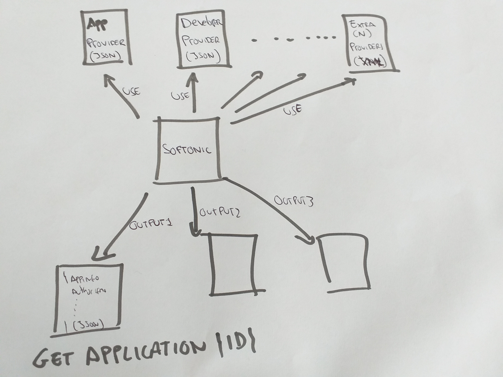
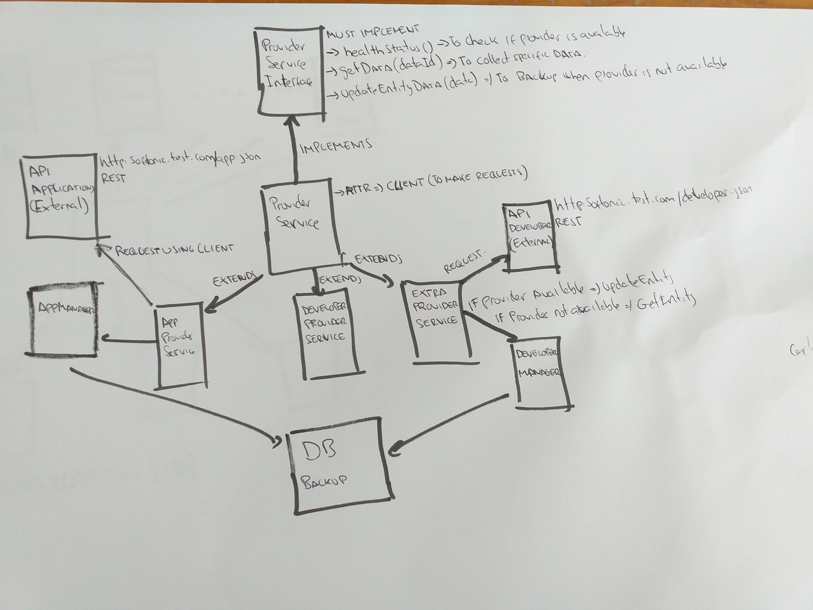

# PREAMBULO
_Para la realizacion de esta prueba se ha optado por un sistema distribuido y dockerizado compuesto por un docker nginx como servidor web, un docker de base de datos, y el docker de la aplicacion; para este ultimo docker, se ha optado por un framework symfony simple con servicios de backend_

_El acceso al backend es bajo la ruta http://softonic.test.com/api/, se trata de una API REST, simple que permite el endpoint reflejado en el enunciado_



_Tal y como explica el enunciado se trata de diseñar un sistema de integracion de diferentes proveedores de datos externos de (1 a N) que integran info en un objecto determinado y mostrarlo en formato json utilizando un endpoint de una api REST simple_

_Para los proveedores de datos se usan APIS externas a las que se asume que se acceden a ellas mediante llamadas GET (a veces con algun tipo de authorizacion o token), y ademas que exiten llamadas para accedera alos datos de forma atomica pasando como paramentro un identificador, por ejemplo http://softonic.test.com/app.json?id={ID}, de esta forma accedemos al dato directamente en vez de al listado completo_

_A pesar que se asume el parrfao arriba mencionado para la prueba actual se ha supuesto que las APIS externas se encontraban en el endpoint http://softonic.test.com/app.json para la de applicaciones, http://softonic.test.com/developer.json para la de developers y http://softonic.test.com/extra.xml para la futura API de consulta. Es por ello que bajo el directorio publico de esta aplicacion se encuentran los datos de prueba enviados en el enuncioado asi como uno extra en formato xml_

_Para configurar los endpoinsts correctamente en cada uno de los entornos habria que editar el archivo .env.local y .env.test con los datos especificos para apuntar a APIS externas fuera de la aplicacion, indicando el host el metodo,los atributos y las autorizaciones necesarias_



_El diseño se ha hecho para que en un futuro se puedan ir agregando mas proveedores sin afectar a la funcionalidad del sistema. Tal y como indica la imagen el diseño se ha basado en un sisitema de herencia e implementacion de interfaz. De tal forma si queremos crear un nuevo proveedor crearemos el servico extendiendo de Provider Service e implementaremos las funciones obligatorias, para ello simplemente se editara el fichero de configuracion correspondiente agregando o quitando nuevos proveedores de datos con sus caracterisitcas especiales, se creara el nuevo servicio, se editaran las funciones obligatorias de la interfaz, y desde el controlador podremos crear los nuevos endpoints para los nuevos datos de los nuevos proveedores_

_Un punto muy importante a tener en cuenta en el diseño es el respaldo de los datos en caso de que los proveedores esten caidos en ese momento. Para ello se ha diseñado un sistema de backup basado en bases de datos y entidades simples de symfony para asegurar que aunque los proveedroes no esten activos (la funcion healtstatus falle), exista una version del dato en base de datos, la integracion pueda seguir haciendose, y el output pueda seguir mostrandose_

_Para asegurar al usuario que el dato que esta viendo es el bueno y actualizado, se han incorporado una serie de campos (createdAt y UpdatedAt) que no estaban contamplados en el enunciado en cada una de las entidades, de esta forma cuando se realice el endpoint solicitando la info de una aplicacion veremos un campo updatedAt que debe ir aumentando en cada refresco. Así se asegura que el dato proviene del proveedor y esta actualizado_

_Para una futura ejecucion sobre la linea de comandos se ha preparado un comando de symfony que simula la llamada del endpoint, ademas para hacer la aplicacion como un CLI, bastaria con ejecutar un curl sobre los endpoints en CLI_ 


# INFRAESTRUCTURA DE PROYECTO
### Estructura General

_Build_
```
Configuracion especifica para los servicios de docker instalados 
```
_Mysql_
```
Mapeo del docker de Mysql para tener el acceso dsiponible desde el host 
```
_Symfony_
```
Directorio donde se almacena toda la logica de aplicación  
```
_docker-compose.yml_
```
Fichero para la creacion y despligue de dockers  
```
_Ficheros DockerFile_
```
recetas para la creacion del docker especifico  
```
_Postman Collection_
```
Se trata de un fichero .json que se ha de importar en postman. Es una coleccion de postman con requests ya preparadas para probar la parte del backend  
```
### Estructura Symfony
_Estructura Básica de un proyecto Symfony destacar lo siguiente_

_Config_
```
Necesario para toda la configuracion de la aplicacion  
```
_src_
```
Se encuentra toda la lógica de la aplicación esta compuesto por:
  * Los controladores
  * Las Entidades
  * Las Entidades Tipo Formualrios
  * Servicios de Repositorio, estos servicios son los encargados de realizar las funciones especifas de base de datos    
```
_public_
```
Directorio publico que se muestra en el front, se trata de un directorio dinámico que se genera gracias a la compilacion de webpack      
```
_templates_
```
Este directorio almacena las plantillas twig para el renderizado del front      
```
_tests_
```
Este directorio almacena todos los tests que se ejecutan gracias a PhpUnit      
```
# INSTALACION DEL PROYECTO DE PRUEBA SOFTONIC
_Estas instrucciones te permitirán obtener una copia del proyecto en funcionamiento en tu máquina local para propósitos de desarrollo y pruebas._
### Pre-requisitos 📋
```
* Prueba desarrollada para ser ejecutada bajo SO Linux o Mac
* Asegurar que el puerto 80 esta libre 
* Asegurar que el puerto 3306 esta libre
* Instalar docker y docker-compose | https://www.digitalocean.com/community/tutorials/how-to-install-and-use-docker-compose-on-ubuntu-20-04-es
* Hacer al usuario actual permisos de uso en docker y docker-compose (para no tener que ejecutar los comandos de docker-compose con 'sudo')
* Editar el archivo /etc/hosts y agregar la siguiente linea
    127.0.0.1       softonic.test.com
* Instalar git
```
### Instalación 🔧
_Clonar repositorio_
```
$ git clone https://github.com/Lotykun/softonic.git
```
_Acceder a carpeta y levantar contenedores_
```
$ cd softonic/
softonic (main)$ docker-compose up -d --build
```
_Importar datos a la base de datos_
```
softonic (main)$ docker cp dump.sql mysql_softonic:/dump.sql
softonic (main)$ docker exec mysql_softonic /bin/bash -c 'mysql -uroot -proot < /dump.sql'
```
_Instalar dependencias symfony_
```
doofinder (main)$ docker exec -i -t php_softonic /bin/bash
/var/www/symfony# composer install
/var/www/symfony# exit
```
_Setear Dominio de Test en hosts de Docker_
```
{OBTENER IP LOCAL DE MAQUINA (depende de SO)} = {IP_HOST}
doofinder (main)$ docker exec -i -t php_softonic /bin/bash
/var/www/symfony# nano /etc/hosts
Editar el archivo agregar la siguiente linea
    {IP_HOST}       softonic.test.com
```
_Levantar Nginx encaso de que no este up_
```
doofinder (main)$ docker-start nginx_softonic
```
### Comprobación y Tests 🔧
_Acceder a un navegador y ejecutar la siguiente url_

Deberia devolver un mensage de bienvenida
```
http://softonic.test.com/api/
```
_Ejecucion Modo CLI_
```
softonic (main)$ docker exec php_softonic /bin/bash -c 'bin/console app:get-application id=3075333'
```
_Ejecución de Tests PHPUnit_

En la ruta tests/ se encuentran los tests a ejecutar, cada nombre de función, especifica que tipo de test se realiza
```
softonic (main)$ docker exec -i -t php_softonic /bin/bash
/var/www/symfony# bin/phpunit
```
_Ejecucion Requests Colección Postman_

Importar la coleccion Postman del archivo
```
doofinder (main)$ doofinder.postman_collection.json
```
# POSIBLES MEJORAS A REALIZAR
_* Agregar sistema de Cacheo tipo Redis o Varnish para mejorar el rendimiento_

_* Agregar sistema de pre-procesado o cacheo en los proveedores de datos_

_* Gestion de Usuarios para securizar el acceso a la api_

_* Agregar Traducciones_

_* Averiguar porque el nginx cuando haces docker-compose up. No se levanta directamente algunas veces y hay que hacer docker-start nginx_softonic_